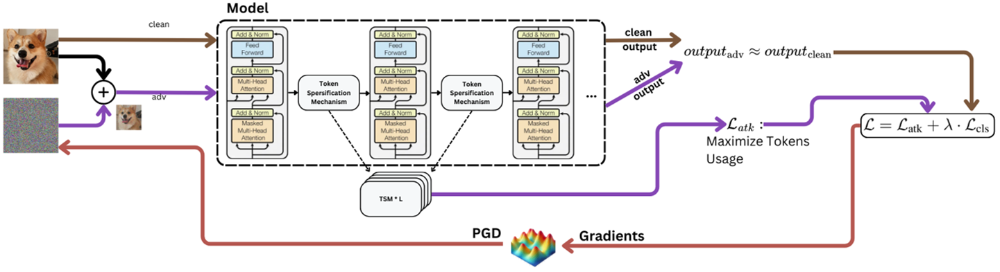
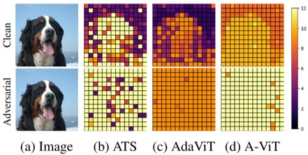
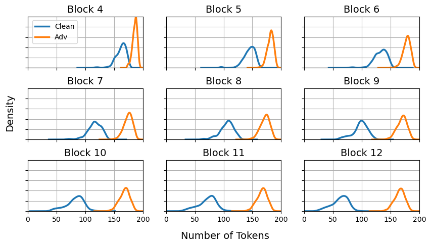

# DeSparsify: Adversarial Attack Against Token Sparsification Mechanisms
[](link_to_paper)
[](https://arxiv.org/abs/2402.02554)



## Abstract
Vision transformers have contributed greatly to advancements in the computer vision domain, demonstrating state-of-the-art performance in diverse tasks (eg. image classification, object detection).
However, their high computational requirements grow quadratically with the number of tokens used.
*Token sparsification* techniques have been proposed to address this issue.
These techniques employ an input-dependent strategy, in which uninformative tokens are discarded from the computation pipeline, improving the model's efficiency.
However, their dynamism and average-case assumption makes them vulnerable to a new threat vector - carefully crafted adversarial examples capable of fooling the sparsification mechanism, resulting in worst-case performance.
In this paper, we present *DeSparsify*, an attack targeting the availability of vision transformers that use token sparsification mechanisms.
The attack aims to exhaust the operating system's resources, while maintaining its stealthiness.
Our evaluation demonstrates the attack's effectiveness on three token sparsification techniques and examines the attack's transferability between them and its effect on the GPU resources.
To mitigate the impact of the attack, we propose various countermeasures.

<p align="center">
  
</p>
<p align="center"><em>Token depth distribution in terms of transformer blocks for a clean (top) and adversarial (bottom) image for three TS mechanisms (b)-(d). The colors indicate the maximum depth each token reaches before being discarded. The adversarial image is crafted using the single-image attack variant, which results in worst-case performance.</em></p>


### Table of Contents
- [Overview](#overview)
- [Installation](#installation)
- [Usage](#usage)
- [Results](#results)
- [Metrics and Evaluation](#metrics-and-evaluation)
- [Contributing](#contributing)
- [Citation](#citation)

## Overview
This repository accompanies our NeurIPS 2024 paper, DeSparsify: Adversarial Attack Against Token Sparsification Mechanisms. It provides:
- The implementation of the DeSparsify attack.
- Detailed experiments demonstrating the attack's impact on token sparsification mechanisms.
- Tools to reproduce the results and extend the work for further research.

The attack targets adaptive token selection methods like ATS, AdaViT, and A-ViT, exploiting their dynamic nature to degrade performance while maintaining original model predictions.

## Installation

## Usage

## Results

### ATS Evaluation Table
| **Perturbation**        | **Accuracy** | **GFLOPS** (Change %) | **TUR** (Change %) |
|--------------------------|--------------|------------------------|--------------------|
| **Clean**               | 88.5%       | 3.09 (0%)             | 0.54 (0%)         |
| **Single**              | **88.2%**   | **4.20 (74%)**        | **0.88 (75%)**    |
| **Ensemble (Single)**   | 85.6%       | 3.83 (50%)            | 0.78 (52%)        |
| **Class-Universal**     | 83.7%       | 3.40 (21%)            | 0.63 (22%)        |
| **Universal**           | 84.4%       | 3.31 (14%)            | 0.62 (15%)        |
| **Universal Patch**     | 4.6%        | 3.68 (40%)            | 0.73 (42%)        |

---
### Hardware Metrics Evaluation

| **Perturbation**        | **Memory [Mbits]** (Change) | **Energy [mJ]** (Change) | **Throughput [ms]** (Change) |
|--------------------------|----------------------------|--------------------------|-----------------------------|
| **Clean**               | 240 (1.00×)               | 2663 (1.00×)            | 12.8 (1.00×)               |
| **Single**              | **329 (1.37×)**           | **4595 (1.72×)**        | **13.8 (1.08×)**           |
| **Ensemble (Single)**   | 295 (1.23×)               | 3587 (1.34×)            | 13.1 (1.03×)               |
| **Class-Universal**     | 261 (1.08×)               | 3926 (1.47×)            | 13.3 (1.04×)               |
| **Universal**           | 250 (1.04×)               | 3404 (1.27×)            | 13.1 (1.03×)               |
| **Universal Patch**     | 280 (1.16×)               | 4125 (1.55×)            | 13.4 (1.05×)               |

### Visualization

<p align="center">
  
</p>
<p align="center"><em>Distribution of activated tokens in each ATS block on clean and adversarial images.</em></p>


## Metrics and Evaluation
We use the following metrics to evaluate the attack:
- Token Utilization Ratio (TUR): the ratio of active tokens (those included in the computation pipeline during model inference) to the total number of tokens in the vision transformer model.
- Memory Consumption: the GPU memory usage during model inference.
- Throughput: the amount of time it takes the model to process an input and produce the output.
- Energy Consumption: the overall GPU power usage during inference. This metric provides insights into the attack’s influence on energy efficiency and environmental considerations.
- Giga Floating-Point Operations per Second (GFLOPS): the number of floating-point operations executed by the model per second.
- Accuracy: the performance of the model on its original task.

## Contributing
Contributions are welcome! Feel free to report issues, suggest features, or submit improvements via pull requests.

## Citation
```bibtex
@article{yehezkel2024desparsify,
  title={DeSparsify: Adversarial Attack Against Token Sparsification Mechanisms in Vision Transformers},
  author={Yehezkel, Oryan and Zolfi, Alon and Baras, Amit and Elovici, Yuval and Shabtai, Asaf},
  journal={arXiv preprint arXiv:2402.02554},
  year={2024}
}
```
